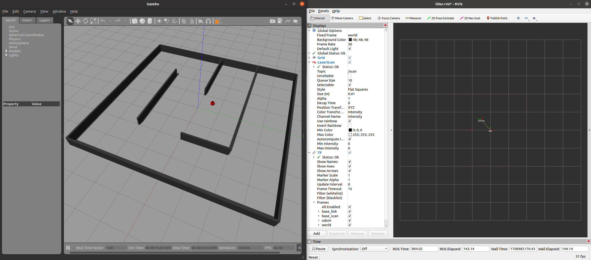

# wall-following-qlearning
Implementation of robot wall following based on Q learning in both simulation and real-world.   
It's the final project for **NC State CSC591-Advanced Robotics** taught by Professor Gao Peng.

# Demo


# Stingray Simulation Package
This package contains the triton robot simulation package. 
0
## Installation

### Install ROS Noetic
Follow the instructions to install ROS Noetic for Ubuntu 20.04 at: http://wiki.ros.org/noetic/Installation/Ubuntu. Please install the ros-noetic-desktop-full version

### Install Other ROS Dependencies
```bash
sudo apt install ros-noetic-gazebo-ros-pkgs ros-noetic-depthimage-to-laserscan ros-noetic-gmapping python3-catkin-tools python3-pip
pip3 install pynput
```

### Create a Catkin Workspace (if none exists)
Follow the instructions at: https://wiki.ros.org/catkin/Tutorials/create_a_workspace

```bash
mkdir -p ~/catkin_ws/src
cd ~/catkin_ws/
catkin_make
```

### Download the Stingray Simulation Repository
```bash
cd ~/catkin_ws/src
git clone https://gitlab.com/peng-lab/stingray_sim.git
```

## Running the Simulation

```bash
cd ~/catkin_ws
catkin_make
source devel/setup.bash
roslaunch stingray_sim wall_following.launch
```

You can implement your code for directly on the files `scripts/q_td_train.py`, `scripts/q_td_run.py`, `scripts/sarsa_train.py`, `scripts/sarsa_run.py`, and run them directly via `rosrun stingray_sim <python_filename>.py`. 

Gazebo and RViz will also automatically launch, as well as some helper nodes for the necessary TF transforms and robot odometry. 



### Optional Steps

There is also an optional `teleop_robot.py` file to manually control the robot which publishes directly to the `/cmd_vel` topic. 

You can optionally use `catkin build` instead of `catkin_make` so that only newly updated ROS packages get recompiled faster. You may need to delete `catkin_ws/devel` and `catkin_ws/build` to switch between the two commands. 
=======

